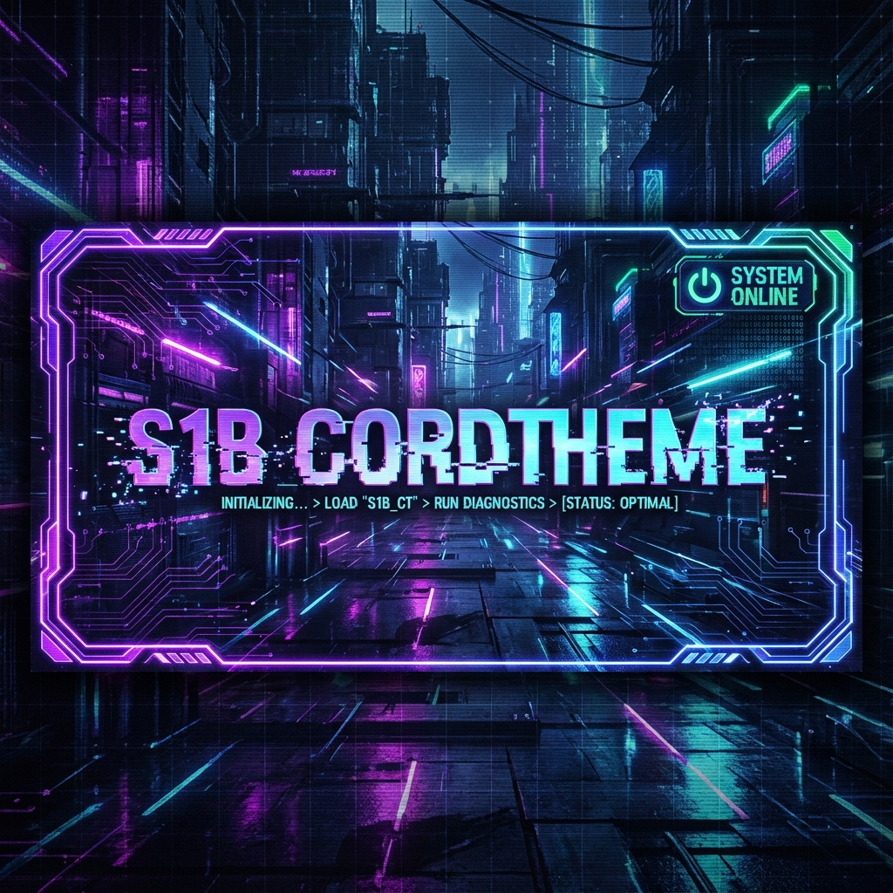
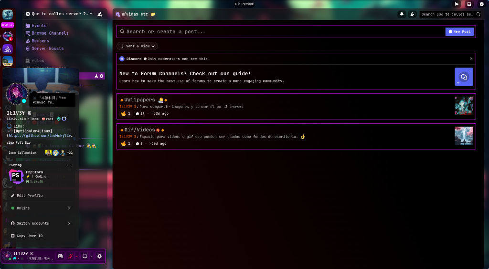
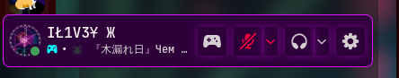
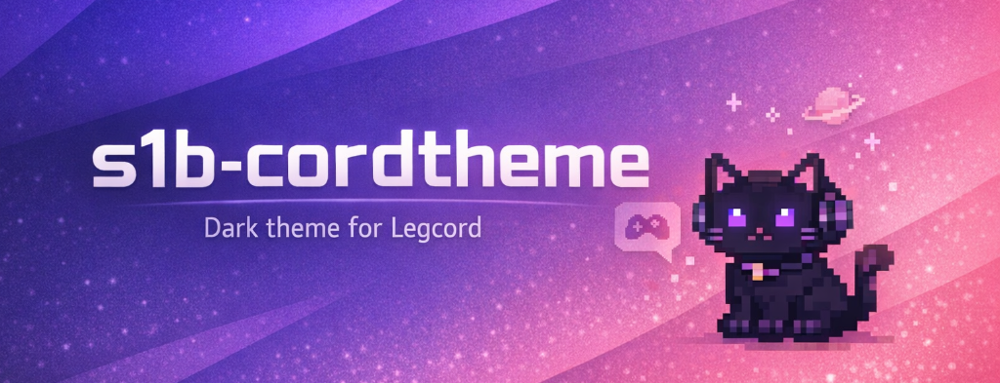

# 🌆 S1B TERMINAL // DISCORD THEME

<div align="center">




<br>

<a href="https://github.com/ind4skylivey/s1b-cordtheme">
  
</a>

<br>

> _Wake up, Samurai. We have a server to burn._ █

</div>

---

## >\_ SYSTEM.BOOT_SEQUENCE

```bash
[root@s1b-terminal ~]# ./init_theme.sh
> Initializing S1B Core... [OK]
> Loading Neon Modules... [OK]
> Bypassing Mainframe Security... [SUCCESS]
> Injecting CSS Payloads...
> SYSTEM OVERRIDE COMPLETE.
> Welcome to the future.
```

## ⚡ SYSTEM OVERRIDE INITIATED

**S1B CordTheme** is not just a skin; it's a total visual overhaul designed to turn your Discord client into a **futuristic command center**. Built for those who live in the terminal and dream in neon.

### 🔮 VISUAL CORTEX ENHANCEMENTS

- `[NEON_INJECTION]` :: Deep **Neon Purple** highlights mixed with **Cyber Cyan** status indicators.
- `[GLASS_PROTOCOLS]` :: High-end transparency with background blur (`--app-blur`) for depth.
- `[INDUSTRIAL_FRAME]` :: Squared-off corners, glowing borders, and tech-inspired typography (`Rajdhani`).
- `[DYNAMIC_RESPONSE]` :: Elements glow, rotate, and shift upon interaction.

### 📸 VISUAL_INTEL

<div align="center">
  
  <br>
  
</div>

---

## 📥 INJECTION.EXE

Execute the following protocols to override the default UI.

### 🟢 PROTOCOL: LEGCORD (PRIMARY)

```diff
+ 1. Copy the raw link of the 's1btheme.css' file.
+ 2. Open Legcord settings.
+ 3. Navigate to Client Mods -> Themes.
+ 4. Paste URL into Online Themes box.
! 5. RELOAD CLIENT.
```

### 🔵 PROTOCOL: VENCORD / BETTERDISCORD

```diff
- 1. Download 's1btheme.css' from the repository.
- 2. Navigate to Settings -> Themes.
- 3. Drop file into themes folder.
- 4. Engage the switch.
```

---

## 🛠️ NEURAL_CONFIG.SYS

Access the `:root` directory of the CSS to customize your experience.

```css
:root {
  /* 🖼️ VISUAL FEED */
  --custom-image-url: url("https://i.postimg.cc/GhQzTtCX/vector2.png");
  --app-blur: 12px;

  /* 🎨 NEON PALETTE */
  --rgb-highlight: 220, 20, 255; /* Main Neon Purple */
  --app-border-frame: 0, 255, 255; /* Cyan Border Glow */

  /* 🚦 STATUS INDICATORS */
  --rgb-online-color: 0, 255, 255; /* Connected */
  --rgb-dnd-color: 255, 20, 60; /* Combat Mode */

  /* 🔤 TYPOGRAPHY */
  --custom-title-text: "S1b Terminal";
  --custom-title-font-family: "Rajdhani";
}
```

---

## 📊 SYSTEM_DIAGNOSTICS

| COMPONENT         |        STATUS        | INTEGRITY |
| :---------------- | :------------------: | :-------: |
| **Legcord**       |     `[OPTIMAL]`      |   100%    |
| **Vencord**       |    `[COMPATIBLE]`    |    98%    |
| **BetterDiscord** |    `[COMPATIBLE]`    |    95%    |
| **Mobile**        | `[CRITICAL_FAILURE]` |    40%    |

---

## 📂 CORE_ARCHITECTURE

```bash
S1B-DISCORD/
├── 📄 s1btheme.css       # [ENTRY_POINT] Main injection file
├── 📂 awkglass/          # [CORE_MODULES] Base UI framework
│   ├── 📂 core/          # System logic & variables
│   ├── 📂 assets/        # Visual assets & textures
│   └── 📂 fonts/         # Typography data
└── 📄 README.md          # [MANUAL] You are here
```

---

## 📡 NETWORK_UPLINK

Establish a secure connection with the developer.

- `[LINK]` [**GITHUB**](https://github.com/ind4skylivey) `[ACCESS_GRANTED]`
- `[LINK]` [**WEBSITE**](https://ind4skylivey.github.io/) `[PUBLIC_GATEWAY]`

---

<div align="center">

### 🏁 TRANSMISSION ENDS

**Architect**: `il1v3y` | **S1B Group**
_The future is now._

<br>


</div>
